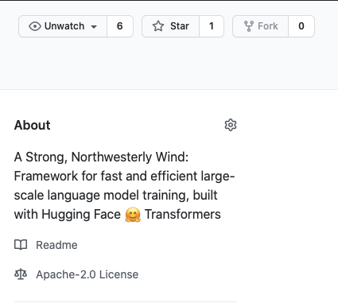

Contributing
============

Mistral is a growing code base, and we are excited for other folks to get involved. The instructions below walk you through our dev setup and how to submit a PR.

Dev Installation
----------------

First follow the same instructions as provided for the :doc:`quickstart <getting_started/install>`

The main addition for a dev environment is to install `pre-commit <https://pre-commit.com/>`_ ::

    pre-commit install

This will set up git hook scripts that ensure your code is formatted in a manner consistent with
the repo. If any problems are found, the appropriate files will be updated with fixes. You will
need to review and commit the fixed files.

Forking The Repo
----------------

To submit changes, you will need to work off of a fork of the repo and issue a pull request.

There are two easy ways to fork the repo.

If you have installed the `GitHub CLI <https://cli.github.com/>`_ you can issue this command ::

    gh repo fork stanford-crfm/mistral --clone=true

This will create the fork and clone the repo into your current directory.

Alternatively you can fork the repo in your browser. While logged in to your GitHub account,
go to the `Mistral repo <https://github.com/stanford-crfm/mistral>`_ and click on the Fork
button in the upper left hand corner.

You can then clone your forked version of the Mistral repo like any other GitHub repo.

Create A Branch For Your Submission
-----------------------------------

You will need to create a branch of ``dev`` for your code changes.  In general every submission
should be focused on a specific set of bug fixes or new features that are coherently
related.  Changes that are not related belong in different submissions. So you should
be able to give your branch an informative name such as ``trainer-ddp-bugfix`` .

You can create a branch off of dev with this command ::

    git checkout -b trainer-ddp-bugfix dev

Implement Your Changes
----------------------

As you implement your changes in your feature branch, the git hook scripts will check your
code for proper formatting as you make commits. Make sure you have run ``pre-commit install``
before you start making commits.

You can also check all files in the current branch with this command: ::

    pre-commit run --all-files

When your changes are operational you should verify that all of the current tests are passing.

Set up your environment for running the tests: ::

    export PYTHONPATH=/path/to/mistral
    export MISTRAL_TEST_DIR=/path/to/test-working-dir
    wandb offline

You can run the tests with this command: ::

    cd mistral/tests
    pytest

You should add tests for any functionality you have added consistent with the `pytest <https://docs.pytest.org/en/6.2.x/>`_ format
of the existing tests.

Submit Pull Request
-------------------

When your feature branch is ready you should submit a pull request.

Detailed instructions for submtting a pull request from a fork can be found on `Github Docs <https://docs.github.com/en/github/collaborating-with-pull-requests/proposing-changes-to-your-work-with-pull-requests/creating-a-pull-request-from-a-fork>`_.

The steps basically are:

1. While logged in to your GitHub, go to the original `Mistral repo pull request page <https://github.com/stanford-crfm/mistral/pulls>`_.

2. Click on the highlighted text stating "compare across forks".

3. Set the base repository to ``stanford-crfm/mistral`` and the base branch to ``dev``.

4. Set the head repository to ``your-org/mistral`` and the compare branch to ``your-feature-branch``.

5. Click on the "Create pull request" button and complete the pull request form.

When submitting your pull request, you should provide a detailed description of what you've done.

The following is a useful template: ::

    **BEFORE YOU START**: please make sure your pull request is against the `dev` branch.
    We cannot accept pull requests against the `main` branch.

    ## Description
    A brief and concise description of what your pull request is trying to accomplish.

    ## Fixes Issues
    A list of issues/bugs with # references. (e.g., #123)

    ## Unit test coverage
    Are there unit tests in place to make sure your code is functioning correctly?

    ## Known breaking changes/behaviors
    Does this break anything in Mistral's existing user interface? If so, what is it and how is it addressed?
