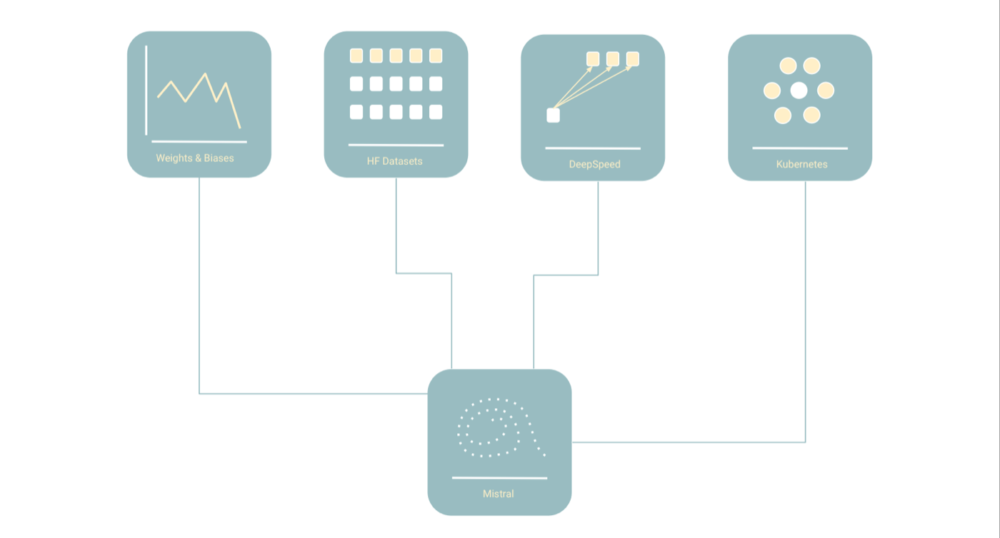

..
   Note: Items in this toctree form the top-level navigation. See `api.rst` for the `autosummary` directive, and for why `api.rst` isn't called directly.

.. toctree::
   :hidden:
   :caption: Getting Started

   Overview <getting_started>
   Installation <getting_started/install.rst>
   Configuration <getting_started/config.rst>
   Training <getting_started/train.rst>
   Download Models <getting_started/download.rst>
   Evaluation <getting_started/evaluate.rst>

.. toctree::
   :hidden:
   :caption: Tutorials

   Training With Multiple GPU's <tutorials/multi-gpu>
   Training On Multiple Nodes With DeepSpeed <tutorials/deepspeed>
   Generate Text With A Trained Model <tutorials/generate>
   Training A Model With Google Cloud + Kubernetes <tutorials/gcp_plus_kubernetes>

.. toctree::
   :hidden:
   :caption: About

   Contributing <contributing>
   API reference <_autosummary/src>
   Differences between Mistral and Hugging Face <hugging_face_differences>

Mistral - Large Scale Language Modeling Made Easy
=====================================================

Mistral combines `Hugging Face <https://huggingface.co/>`_ 🤗, `DeepSpeed <https://www.deepspeed.ai/>`_, and `Weights & Biases <https://wandb.ai/site>`_ ,  with additional tools, helpful scripts, and documentation to facilitate:

* training large models with multiple GPU's and nodes
* incorporating new pre-training datasets
* dataset preprocessing
* monitoring and logging of model training
* performing evaluation and measuring bias

.. _Mistral: https://github.com/stanford-crfm/mistral
