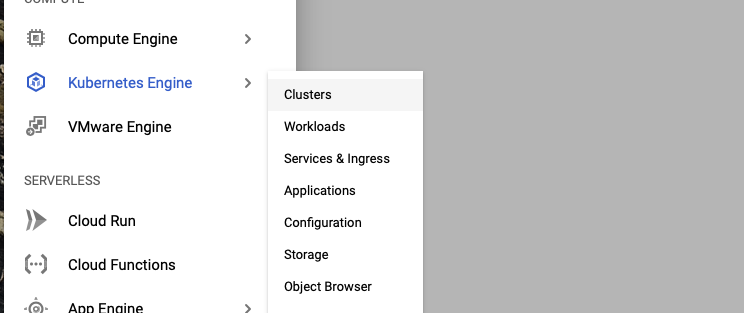
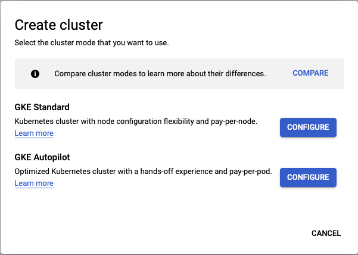
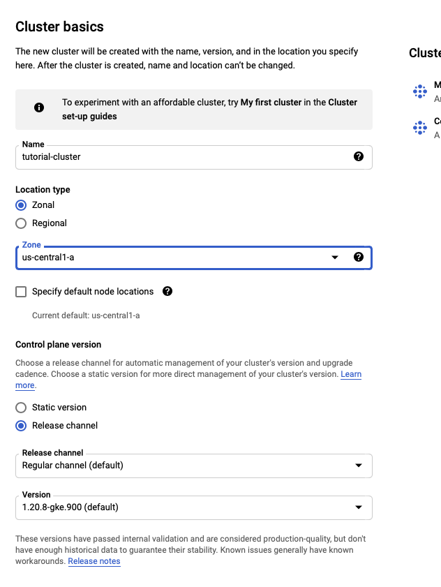
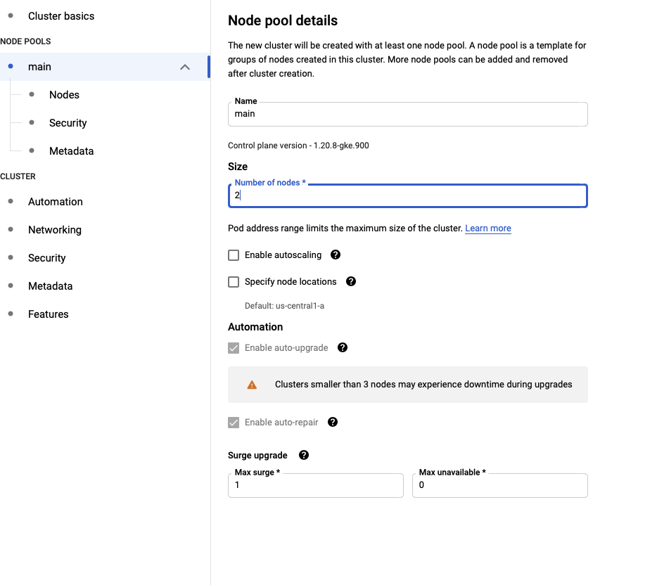
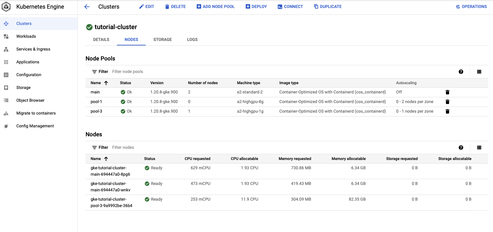
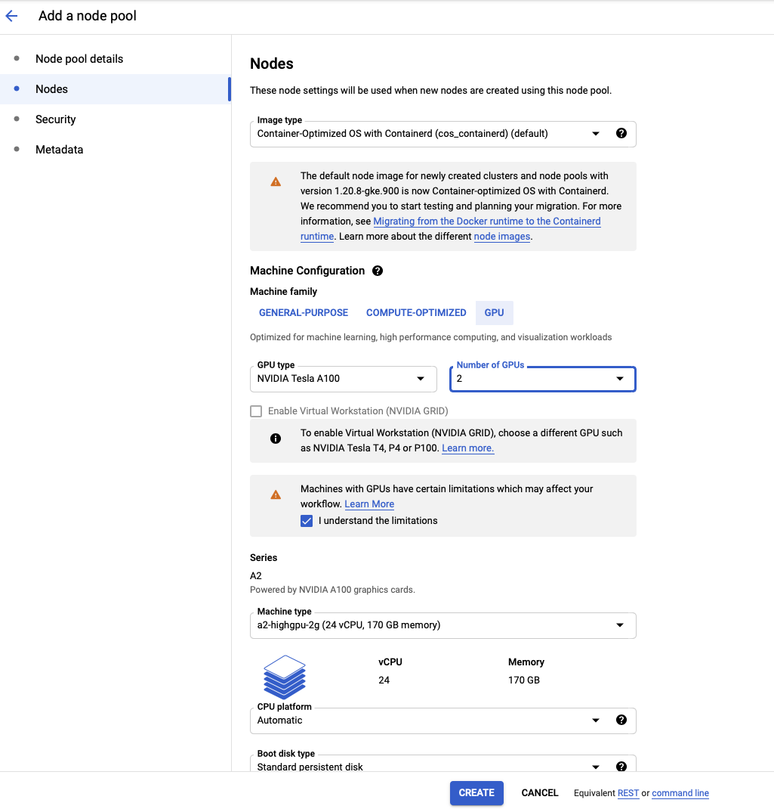

Training A Model With GCP + Kubernetes
======================================

This tutorial will walk through training a model on Google Cloud with `Kubernetes <https://kubernetes.io/>`_.

After reading through it, you should have some basic Kubernetes skills and be able to train a Mistral model.

Preliminaries
-------------

We will assume you have a `Google Cloud <https://cloud.google.com/>`_ account set up already.

For this tutorial you will need to install the `gcloud <https://cloud.google.com/sdk/docs/downloads-interactive>`_ and `kubectl <https://kubernetes.io/docs/tasks/tools/install-kubectl-linux/>`_ command line utilities.

Creating A Kubernetes Cluster
-----------------------------

We will now create a basic Kubernetes cluster with

* 2 main machines for managing the overall cluster
* A node pool that will create GPU machines when jobs are submitted
* A 1 TB persistent volume the machines can use for data storage

This tutorial describes the Kubernetes set up we used when training models, but of course you can customize this set up as you see fit for your situation.

On the Google Cloud Console, go to the "Kubernetes Engine (Clusters)" page. Click on "CREATE".

Choose the "GKE Standard" option.

On the "Cluster basics" page, set the name of your cluster and choose the zone you want for your cluster.
You will want to choose a zone with A100 machines such as ``us-central-1a``. In our working example, we
are calling the cluster "tutorial-cluster".

In the "NODE POOLS" section, change the name of the default pool to "main". Click on "Nodes" and change
the machine type to "e2-standard".

When finished, click "CREATE" at the bottom and the Kubernetes cluster will be created.

Adding A Node Pool To Your Cluster
----------------------------------

When the cluster has finished, you can click on its name and see cluster info. Click on "NODES". You
will be brought to a page that shows the node pools for the cluster and the nodes.

At the top of the screen click on "ADD NODE POOL". Set the name of the node pool to "node-1". Set the number of nodes
to 0 and check "Enable autoscaling". With autoscaling, Kubernetes will launch nodes when you submit jobs. When there
are no active jobs, you will have no active machines running. When a job is submitted, the node pool will scale up to
meet the needs of the job. Set the minimum number of nodes to 0 and set the maximum to the maximum number of GPU machines
you want running at any given time.

Click on "Nodes" on the left sidebar, and customize the types of machines the node pool will use. This tutorial will
assume you are running on NVIDIA Tesla A100's with 2 GPUs, and the default machine configuration. Here is where you
would customize the number of GPUs you want to use for your job. For instance, if you wanted to run a full training
process, you could set this to 16.

When finished, click "CREATE". You should see "pool-1" show up in your list of node pools.

Creating The Persistent Volume
------------------------------

The next step is to create the persistent volume. We will create a 1 TB volume, though you may want more space.

You will need to have installed ``gcloud`` and ``kubectl``. Instructions for installing them can be found in
the "Preliminaries" section above.

First create the disk: ::

    gcloud compute disks create --size=1000GB --zone=us-central1-a --type pd-ssd pd-tutorial

Then set up the nfs server (from the ``gcp`` directory in the mistral repo): ::

    kubectl apply -f nfs/nfs_server.yaml
    kubectl apply -f nfs/nfs_service.yaml
    kubectl get services

You should see output like this: ::

    NAME         TYPE        CLUSTER-IP     EXTERNAL-IP   PORT(S)                      AGE
    kubernetes   ClusterIP   10.48.0.1      <none>        443/TCP                      135m
    nfs-server   ClusterIP   10.48.14.252   <none>        2049/TCP,20048/TCP,111/TCP   11s

Extract the IP address for the nfs-server (10.48.14.252 in the example output), and update the ``nfs/nfs_pv.yaml``
file. Then run: ::

    kubectl apply -f nfs_pv.yaml

You should see output like: ::

    NAME                          READY   STATUS    RESTARTS   AGE
    nfs-server-697fbd7f8d-pvsdb   1/1     Running   0          14m

The persistent volume should now be ready for usage.

Installing Drivers
------------------

Run this command to set up the GPU drivers. If you do not run this command, nodes will be unable to use GPUs. ::

    kubectl apply -f https://raw.githubusercontent.com/GoogleCloudPlatform/container-engine-accelerators/master/nvidia-driver-installer/cos/daemonset-preloaded.yaml

Setting Up The Docker Image
---------------------------

It is helpful to set up core dependencies in a Docker container that will be used when running training.

An example Dockerfile with useful dependencies can be found at ``gcp/Dockerfile``:

.. include:: ../../gcp/Dockerfile
   :literal:

You can add any other useful dependencies you wish to this file.

To upload the image to GCP, run this command (in the ``gcp`` directory): ::

    gcloud builds submit --tag gcr.io/<your-project>/img-torch1.8 . --machine-type=n1-highcpu-8 --timeout=2h15m5s

When this process completes, you should see an image named ``img-torch1.8`` in your `Container Registry <https://console.cloud.google.com/gcr/>`_.

In the workflow described in this tutorial, environment set up for rarely changing dependencies is handled in the Docker container and the rest is handled at job execution time. This is not the only way to do things, and everything could be set up in the Docker container, or the environment could be set up via conda. Feel free to customize!

Launching A Basic Pod
----------------------------------------------

It can be helpful to launch a pod to add content to your file system and set up your environment.

We provide a basic pod specification which will allow for that at ``gcp/pod.yaml``:

.. include:: ../../gcp/pod.yaml
   :literal:

You can launch this pod with this command: ::

    kubectl apply -f gcp/pod.yaml

After a few minutes you should see the pod available via this command: ::

    kubectl get pods

You should see something like this: ::

    NAME                          READY   STATUS    RESTARTS   AGE
    nfs-server-55d497bd9b-z5bhp   1/1     Running   0          25h
    pod-1                         1/1     Running   0          48m

You can start a bash session on your pod with this command: ::

    kubectl exec -ti pod-1 -- bash

When you're done with your bash session, you can delete the pod with this command: ::

    kubectl delete pod pod-1

In the next section we will run through some basic set up using this pod.

Setting Up Mistral
------------------

While in the bash session on pod-1 (see last section), run the following
commands to set up Mistral and Weights and Biases: ::

    export HOME=/home
    git clone https://github.com/stanford-mercury/mistral.git
    cd mistral
    wandb init

Add the API key from `https://wandb.ai/authorize<https://wandb.ai/site>`_ to the file ``/home/.wandb/auth``
to allow communication with Weights and Biases. If you don't want to store your API key on the persistent
volume, you can look into using `Kubernetes Secrets<https://cloud.google.com/kubernetes-engine/docs/concepts/secret>`_.

Follow the instructions for authorizing Weights and Biases, as in the :doc:`installation <../getting_started/install>` section.

Running A Training Job
----------------------

You're now ready to start training a model!

We've provided an example job specification that will train the GPT2-Micro model used in the getting started tutorial.
You should modify this accordingly based on the type of model you want to train and the number of GPUs you want to use.

The job specification can be found at ``gcp/job-gpt2-micro.yaml``:

.. include:: ../../gcp/job-gpt2-micro.yaml
   :literal:

The demo script ``gcp/run-demo-job.sh`` simply launches training with DeepSpeed:

.. include:: ../../gcp/run-demo-job.sh
   :literal:

Make sure to update ``conf/tutorial-gpt2-micro.yaml`` to include your project specific values for Weights & Biases
and the directories to store the cache and models, as described in the :doc:`Configuration section<../getting_started/config>`.

You can learn more about DeepSpeed training in the :doc:`DeepSpeed tutorial<deepspeed>`.

To launch the job, run this command: ::

    kubectl apply -f gcp/job-gpt2-micro.yaml

Uploading Models To A GCP Bucket
--------------------------------

When your training is complete, you'll want to transfer your model to cloud storage.

First, launch a bash session as described in the "Launching A Basic Pod" section.

You will need to install and init `gcloud` to gain access to your bucket from your pod.

Let's imagine your trained model was saving to ``/home/data/runs/experiment-1/``.

Then you can easily upload the checkpoints for this run with this command: ::

    gsutil -m cp -r /home/data/runs/experiment-1 gs://my-bucket/runs
